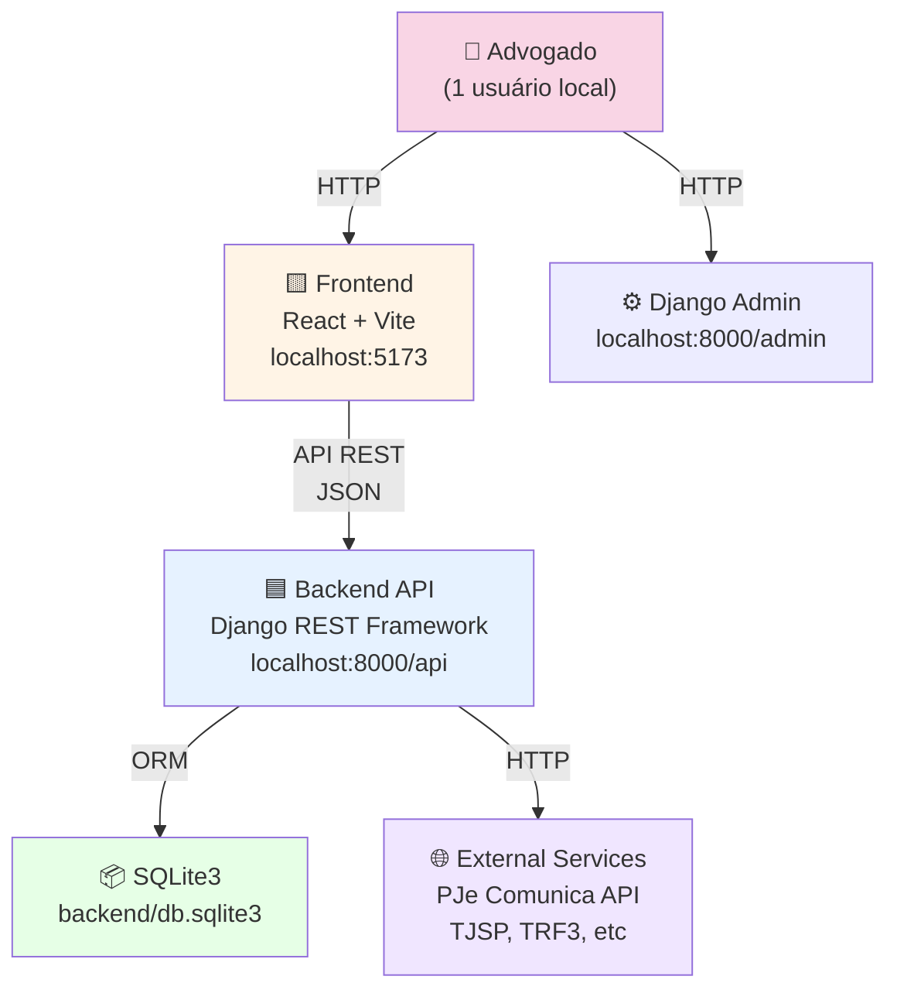
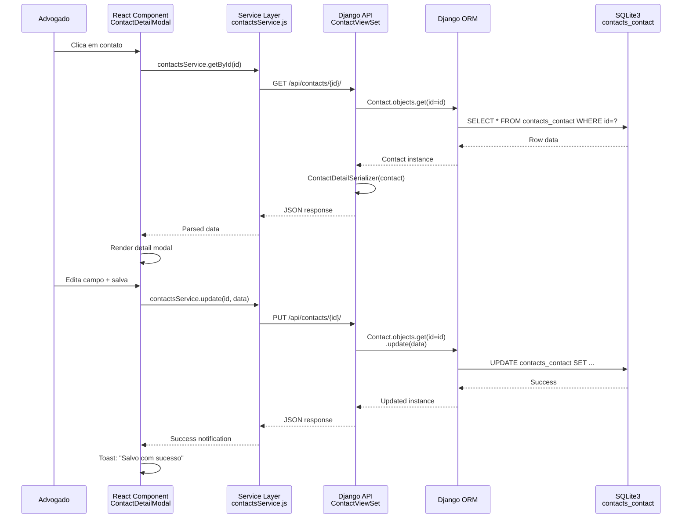
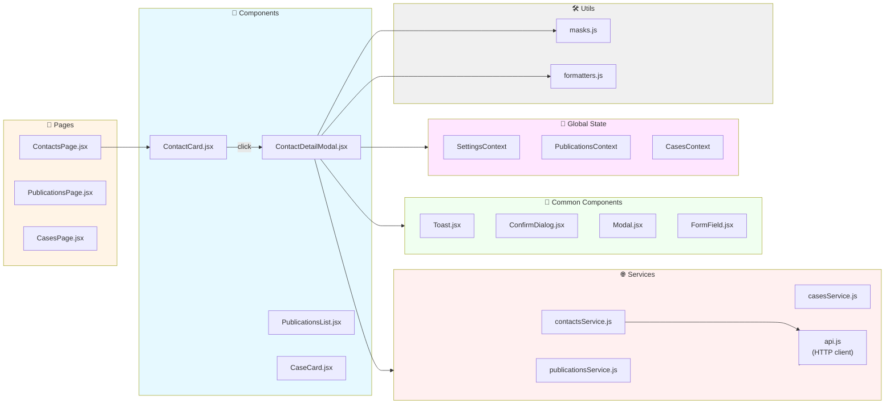
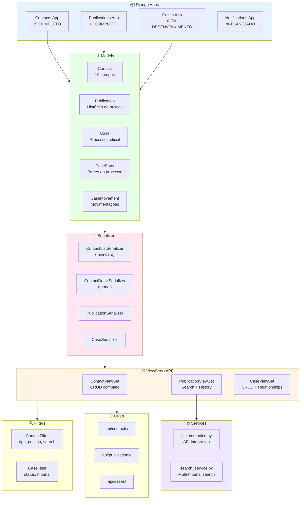
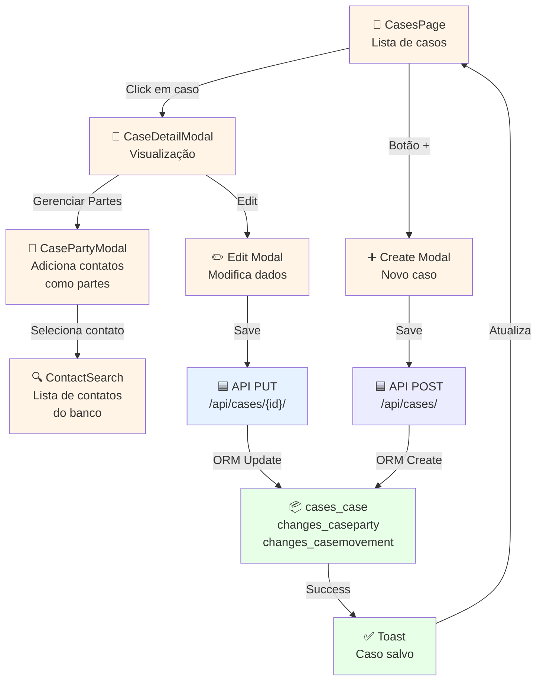
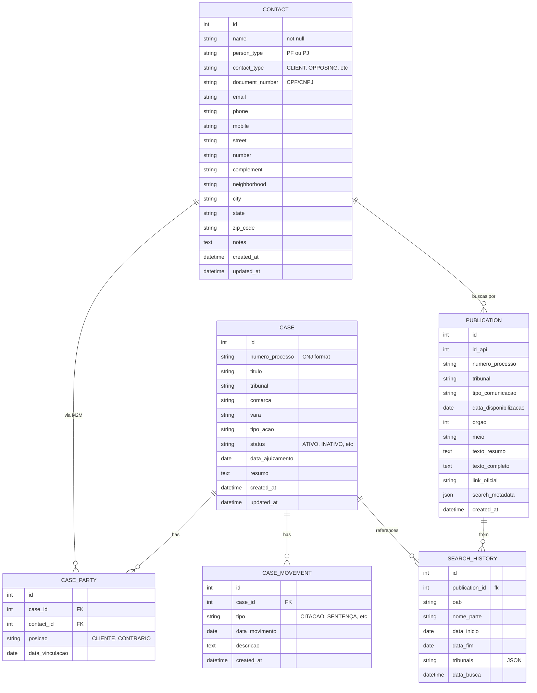
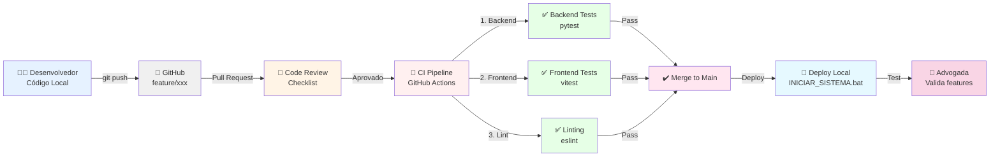

# 🏗️ ARQUITETURA DO PROJETO - Diagramas e Fluxos

---

## 1. ARQUITETURA GERAL DO SISTEMA



---

## 2. FLUXO DE DADOS - APP CONTACTS



---

## 3. ARQUITETURA DO FRONTEND



---

## 4. ARQUITETURA DO BACKEND



---

## 5. FLUXO DE BUSCA DE PUBLICAÇÕES

```mermaid
graph LR
    User["👤 Advogado<br/>na PublicationsPage"]

    User -->|1. Seleciona datas<br/>+ tribunais| Form["📋 Search Form"]

    Form -->|2. POST /api/publications/search/| Backend["🟦 Django Backend"]

    Backend -->|3. Inicia 8 tasks paralelas| Parallel["🔄 Parallel Search<br/>TJSP (OAB+Nome)<br/>TRF3 (OAB+Nome)<br/>TRT2 (OAB+Nome)<br/>TRT15 (OAB+Nome)"]

    Parallel -->|4. Cada task faz HTTP| APIs["🌐 Externa APIs<br/>PJe Comunica<br/>Publicações Oficiais"]

    APIs -->|5. Retorna HTML| Parser["🔍 HTML Parser<br/>Extrai dados + tabelas"]

    Parser -->|6. Salva no banco| DB["📦 SQLite3<br/>publications_publication<br/>+ publicações_searchhistory"]

    DB -->|7. Retorna JSON| Frontend["🟨 Frontend"]

    Frontend -->|8. Renderiza em lista| Results["📰 Results<br/>Cards com publicações<br/>+ HTML renderizado"]

    Results -->|click| DetailModal["📄 Detail Modal<br/>Texto completo<br/>Botões de ação"]

    DetailModal -->|ESAJ| OpenBrowser["🔗 Abre consulta<br/>no portal do tribunal"]

    style User fill:#f9d5e5
    style Form fill:#fff4e6
    style Backend fill:#e6f2ff
    style Parallel fill:#e6f2ff
    style APIs fill:#f0e6ff
    style Parser fill:#e6f2ff
    style DB fill:#e6ffe6
    style Frontend fill:#fff4e6
    style Results fill:#fff4e6
    style DetailModal fill:#fff4e6
    style OpenBrowser fill:#ffe6e6
```



---

## 6. FLUXO DE GESTÃO DE CASOS



---

## 7. ESTRUTURA DE BANCO DE DADOS



---

## 8. FLUXO DE CI/CD RECOMENDADO (FUTURO)



---

## 9. MAPA MENTAL - COMPONENTES DO FRONTEND

```
Frontend (React + Vite)
├── 📄 Pages
│   ├── ContactsPage ✅
│   ├── PublicationsPage ✅
│   ├── CasesPage ⏳
│   └── NotificationsPage 🔜
│
├── 🧩 Componentes Específicos
│   ├── Contacts
│   │   ├── ContactCard ✅
│   │   ├── ContactDetailModal ✅
│   │   └── ContactForm ✅
│   ├── Publications
│   │   ├── PublicationsList ✅
│   │   ├── PublicationsStats ✅
│   │   └── PublicationDetailModal ✅
│   └── Cases
│       ├── CaseCard ⏳
│       ├── CaseDetailModal ⏳
│       └── CasePartyManager ⏳
│
├── 🔄 Componentes Reutilizáveis (common/)
│   ├── Toast ✅
│   ├── ConfirmDialog ✅
│   ├── Modal (base) ✅
│   ├── FormField ✅
│   ├── Button 🔜
│   ├── Badge 🔜
│   └── SearchBox 🔜
│
├── 🏗️ Layout
│   ├── Header ✅
│   ├── Menu ✅
│   ├── MainContent ✅
│   └── Sidebar ✅
│
├── 🎯 Global State (Context API)
│   ├── SettingsContext ✅
│   ├── PublicationsContext ✅
│   └── CasesContext ⏳
│
├── 🔗 Services Layer
│   ├── api.js (HTTP client) ✅
│   ├── contactsService ✅
│   ├── publicationsService ✅
│   └── casesService ⏳
│
├── 🛠️ Utils
│   ├── masks.js (formatação) ✅
│   ├── formatters.js ✅
│   └── validators.js 🔜
│
└── 🎨 Styles
    ├── palette.css (design system) ✅
    ├── index.css (reset) ✅
    └── [Component].css (por componente) ✅
```

---

## 10. STACK VISUAL

```
┌─────────────────────────────────────────┐
│          USUÁRIO (Advogado)             │
└─────────────────────────────────────────┘
                    │
                    ↓
┌─────────────────────────────────────────┐
│         FRONTEND (React + Vite)         │
│  - ContactsPage                         │
│  - PublicationsPage                     │
│  - CasesPage                            │
│  - UI Components (Toast, Modal, etc)    │
│  - localStorage (para settings)         │
└─────────────────────────────────────────┘
           HTTP (localhost:5173)
                    │
                    ↓
┌─────────────────────────────────────────┐
│     BACKEND (Django REST Framework)     │
│  - Config (settings, urls, middleware)  │
│  - Apps (contacts, publications, cases) │
│  - Models (Contact, Case, Publication)  │
│  - ViewSets (API endpoints)             │
│  - Serializers (JSON conversion)        │
│  - Filters (search, filtering)          │
│  - Admin (Django admin interface)       │
│  - Services (external APIs)             │
└─────────────────────────────────────────┘
         SQLite3 ORM (localhost:8000)
                    │
                    ↓
┌─────────────────────────────────────────┐
│   DATABASE (SQLite3 local)              │
│  - db.sqlite3 (arquivo único)           │
│  - Tables: contacts, cases, cases_party │
│  - Tables: publications, search_history │
│  - All data local (no cloud)            │
└─────────────────────────────────────────┘

┌─────────────────────────────────────────┐
│  EXTERNAL SERVICE (PJe Comunica API)    │
│  - Busca de publicações                 │
│  - API de tribunais                     │
│  - Acesso de leitura (read-only)        │
└─────────────────────────────────────────┘
```

---

## 11. MATURIDADE DO PROJETO POR FASE

```
Fase 1: Contacts       |████████████████ 100% ✅
Fase 2: Refatoração    |██████████░░░░░░░ 60%
Fase 3: Publications   |████████████████ 100% ✅
Fase 4: Cases          |████░░░░░░░░░░░░ 30%
Fase 5: Notifications  |░░░░░░░░░░░░░░░░░ 0%
Fase 6: Relatórios     |░░░░░░░░░░░░░░░░░ 0%
Fase 7: Multi-User     |░░░░░░░░░░░░░░░░░ 0%
```

---

**Última atualização:** 24 de fevereiro de 2026
