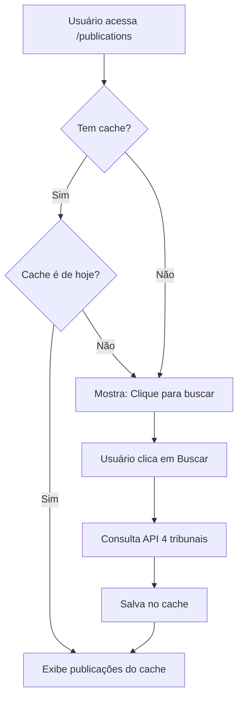

# Sistema de Cache de Publicações

## Visão Geral

O módulo de Publicações implementa um sistema de cache inteligente usando localStorage para otimizar o uso da API pública PJe Comunica e melhorar a experiência do usuário.

## Por Que Cache?

A API PJe Comunica é pública e tem limites de requisições (rate limiting):

- **20 requisições por minuto** por IP
- Sistema consulta **4 tribunais** (TJSP, TRF3, TRT2, TRT15) = 4 requisições por busca
- Dados de publicações são **estáticos durante o dia** (não mudam após disponibilização)

**Benefícios:**

- ✅ Evita sobrecarga da API pública
- ✅ Resposta instantânea ao usuário
- ✅ Funciona offline após primeira consulta
- ✅ Reduz consumo de banda

## Como Funciona

### 1. Busca Manual (On-Demand)

Ao acessar `/publications`, o sistema:

1. **NÃO busca automaticamente** (evita requisições desnecessárias)
2. Verifica se há cache válido do dia atual
3. Se encontrar cache válido → exibe imediatamente
4. Se não encontrar → mostra mensagem para clicar em "Buscar Publicações"

### 2. Cache Local

**Estrutura do cache:**

```json
{
  "date": "2026-02-16",
  "data": [
    {
      "id_api": 516309493,
      "numero_processo": "1003498-11.2021.8.26.0533",
      "tribunal": "TJSP",
      "tipo_comunicacao": "Intimação",
      ...
    }
  ]
}
```

**Chave:** `publications_cache`  
**Localização:** `localStorage` do navegador  
**Validade:** Até às 23:59:59 do dia atual (baseado na data ISO)

### 3. Invalidação Automática

- **Mudança de dia:** Cache é automaticamente invalidado à meia-noite
- **Manual:** Clicar em "Buscar Publicações" sempre busca dados novos e atualiza o cache

## Fluxo de Uso



## Vantagens para o Usuário

1. **Primeira visita do dia:**
   - Clica em "Buscar Publicações"
   - Aguarda ~5-10 segundos (consulta 4 tribunais)
   - Publicações aparecem

2. **Próximas visitas no mesmo dia:**
   - Publicações aparecem **instantaneamente**
   - Sem espera, sem novas requisições à API

3. **Próximo dia:**
   - Cache é invalidado automaticamente
   - Nova busca traz dados atualizados

## Informações Técnicas

### localStorage vs sessionStorage

Usamos `localStorage` em vez de `sessionStorage` porque:

- Dados persistem entre abas/sessões do navegador
- Advogada pode fechar o navegador e dados permanecem
- Cache é válido por dia completo, não apenas por sessão

### Tamanho do Cache

- **Limite do localStorage:** 5-10 MB (depende do navegador)
- **Tamanho médio de 1 publicação:** ~1-2 KB
- **Capacidade estimada:** 2500-5000 publicações sem problemas

### Tratamento de Erros

Se houver erro ao salvar/ler cache:

- Sistema registra erro no console
- Remove cache corrompido
- Permite nova busca normalmente
- Não bloqueia a funcionalidade

## Melhorias Futuras

### Curto Prazo

- [ ] Badge visual mostrando se dados são do cache
- [ ] Temporizador mostrando há quanto tempo foi feita a última busca

### Médio Prazo

- [ ] Sync com backend (salvar também no servidor)
- [ ] Histórico de publicações dos últimos 7 dias
- [ ] Notificações quando novas publicações aparecerem

### Longo Prazo

- [ ] Service Worker para funcionamento offline completo
- [ ] IndexedDB para cache mais robusto (quando volume aumentar)
- [ ] WebSocket para atualizações em tempo real

## Configuração

### Limpar Cache Manualmente (DevTools)

```javascript
// Console do navegador
localStorage.removeItem("publications_cache");
```

### Desabilitar Cache (para testes)

Editar `PublicationsPage.jsx`:

```javascript
// Comentar estas linhas:
// const hasCache = loadFromCache();
// if (!hasCache) { ... }

// Resultado: sempre busca da API
```

## Monitoramento

### Métricas Importantes

- **Cache Hit Rate:** % de vezes que cache foi usado vs busca na API
- **Tempo de resposta:** Cache (<100ms) vs API (~5-10s)
- **Requisições economizadas:** Número de buscas evitadas por dia

### Logs no Console

```
📦 5 publicações carregadas do cache
✅ 5 publicações encontradas em 4 tribunais
```

## Conformidade

- ✅ **LGPD:** Dados são públicos (não há informações sensíveis)
- ✅ **Performance:** Cache reduz latência de 5-10s para <100ms
- ✅ **Disponibilidade:** Sistema funciona mesmo se API PJe estiver lenta/offline (com cache)
- ✅ **Rate Limiting:** Respeita limites da API pública

---

**Última atualização:** 16/02/2026  
**Responsável:** Sistema Legal - Módulo Publicações
